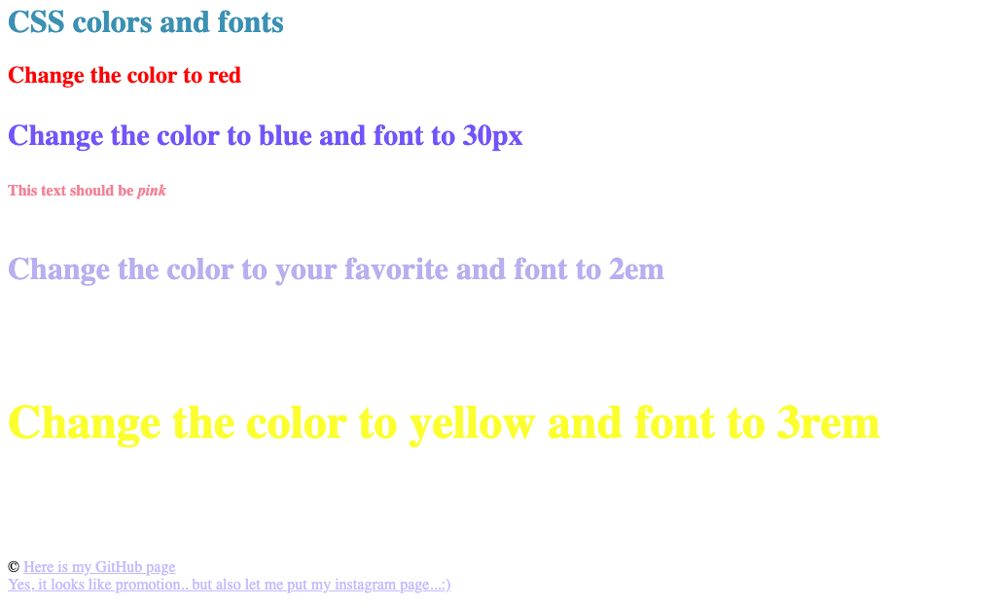

# CSS exercise 1

**The first task is to practice colors of fonts and font size in css.**

[Example of first task is here](https://yaninatrekhleb.github.io/learn-html-css/css/exercise-1/learn-css-colors.html)

[Code page is here](learn-html-css/css/exercise-1/learn-css-colors.html)