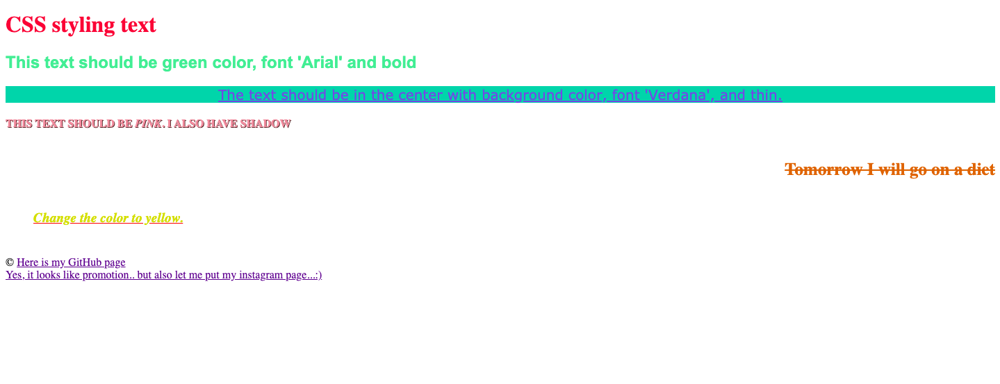

# CSS exercise 2

**The second task is to practice styling text in css.**

[Example of the second task is here](https://yaninatrekhleb.github.io/learn-html-css/css/exercise-2/learn-css-styling-text.html)

[Code page is here]()
