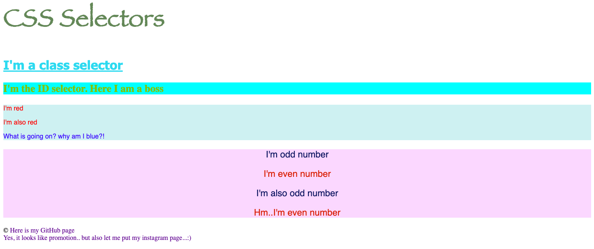

# CSS exercise 3

**The third task is for practicing selectors in css.**

[Example of the second task is here](https://yaninatrekhleb.github.io/learn-html-css/css/exercise-3/learn-css-selectors.html)

[Code page is here](https://github.com/YaninaTrekhleb/learn-html-css/blob/master/css/exercise-3/learn-css-selectors.html)

[Style page is here](https://github.com/YaninaTrekhleb/learn-html-css/blob/master/css/exercise-3/learn-css-selectors.css)