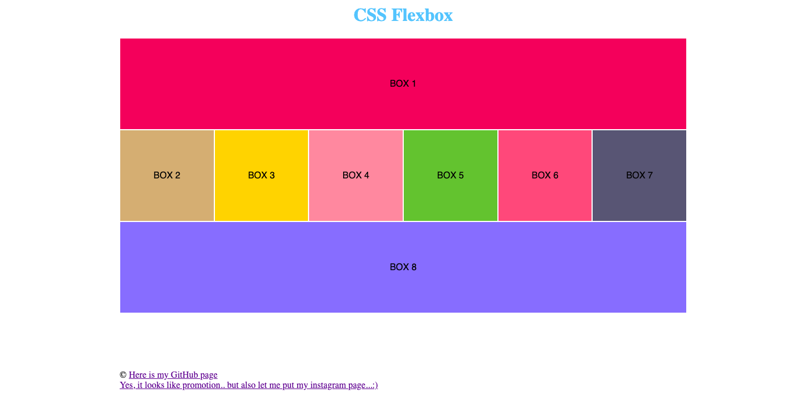

# CSS exercise 4

**The fourth task is for practicing flexbox in css.**

[Example of the second task is here](https://yaninatrekhleb.github.io/learn-html-css/css/exercise-4/learn-css-flex.html)

[Code page is here](https://github.com/YaninaTrekhleb/learn-html-css/blob/master/css/exercise-4/learn-css-flex.html)

[Style page is here](https://github.com/YaninaTrekhleb/learn-html-css/blob/master/css/exercise-4/learn-css-flex.css)