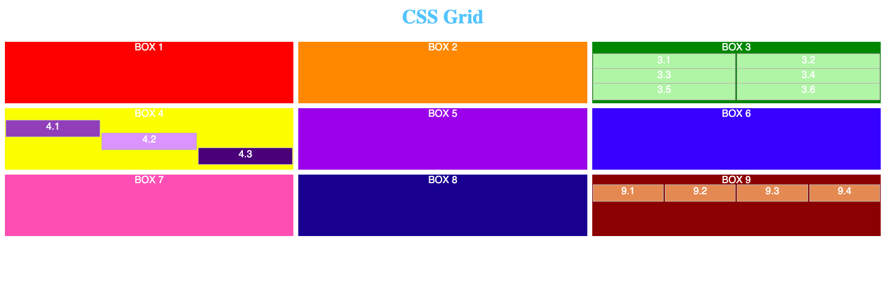

# CSS exercise 5

**The fifth task is for practicing grid model in css.**

[Example of the second task is here](https://yaninatrekhleb.github.io/learn-html-css/css/exercise-5/learn-css-grid.html)

[Code page is here]()